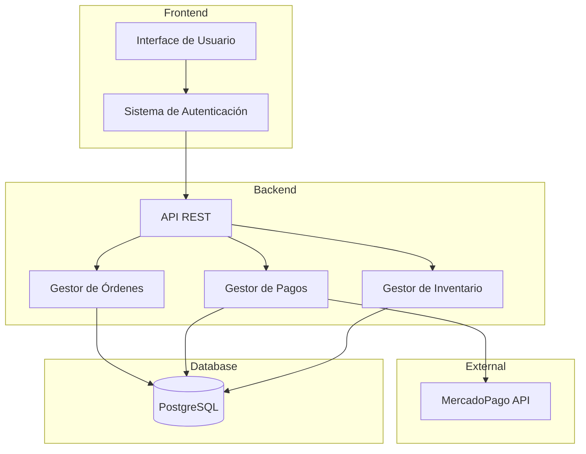

# CaféSystem

Sistema de gestión para cafeterías que permite el manejo de mesas, órdenes y pagos.

## 🚀 Características

- Sistema de autenticación para diferentes roles (cajero/cocinero)
- Gestión de mesas y estados
- Creación y seguimiento de órdenes
- Procesamiento de pagos (efectivo y MercadoPago)
- Control básico de inventario
- Panel de cocina con órdenes pendientes
- Integración con criptomonedas
- Reportes y analytics
- Gestión avanzada de inventario
- Sistema de turnos de personal
- Integración con sistemas contables

## 🛠 Tecnologías

- **Backend**: Python
- **Base de datos**: PostgreSQL
- **Pagos**: MercadoPago API
- **Frontend**: [Por definir]

## 📋 Requisitos del Sistema

- Python 3.10+
- PostgreSQL 14+

## 🔧 Instalación

```bash
# Clonar el repositorio
git clone [url-del-repositorio]

# Crear entorno virtual
python -m venv venv

# Activar entorno virtual
# Windows:
venv\Scripts\activate
# Unix o MacOS:
source venv/bin/activate

# Instalar dependencias
pip install -r requirements.txt

# Configurar variables de entorno
cp .env.example .env

# Ejecutar migraciones
[comandos de migración por definir]
```

## ⚙️ Configuración

1. Crear archivo `.env` basado en `.env.example`
2. Configurar credenciales de base de datos
3. Configurar credenciales de MercadoPago
4. [Otros pasos de configuración]

## 🚦 Uso

```bash
# Iniciar el servidor
[comando por definir]
```

### Roles de Usuario

#### Cajero
- Gestión de mesas
- Creación de órdenes
- Procesamiento de pagos
- Control de inventario

#### Cocinero
- Vista de órdenes pendientes
- Actualización de estado de órdenes
- Control de inventario de cocina

## 🗄️ Estructura del Proyecto

```
cafesystem/
├── backend/
│   ├── api/
│   ├── core/
│   ├── models/
│   └── tests/
├── frontend/
├── docs/
└── scripts/
```

## 👥 Contribución

Por el momento este es un proyecto individual y no se aceptan contribuciones externas.


## 📝 Notas Adicionales

Este proyecto está en desarrollo activo. La documentación se actualizará a medida que se implementen nuevas características.


